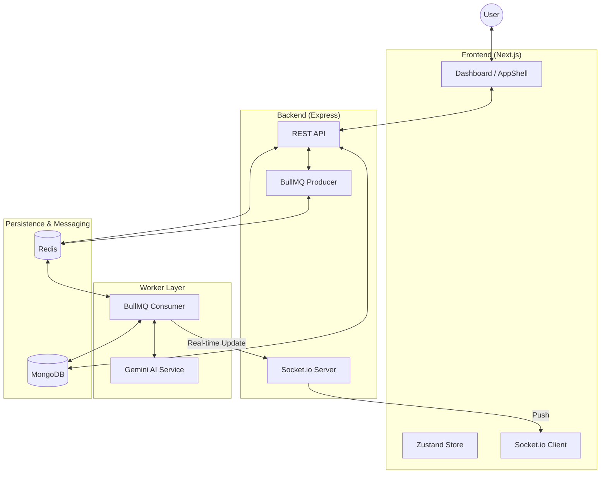

# High-Level Design (HLD) - VedaAI

## 🏗️ System Architecture

## 🧩 Component Breakdown

### 1. Frontend (Next.js)
- **Dashboard**: Handles "Exact UI" replication for assignment management.
- **AppShell**: Manages conditional rendering for desktop and mobile views.
- **WebSocket Integration**: Listens for `generation:progress` events to update the UI in real-time.

### 2. Backend (Express)
- **API Routes**: Handles CRUD operations for assignments and results.
- **Queue Management**: Enqueues AI generation tasks to Redis via BullMQ.
- **WebSocket Gateway**: Forwards progress updates from the background worker to the specific client.

### 3. AI Worker (BullMQ)
- **Isolator**: Separates heavy AI processing from the main API thread.
- **Gemini Service**: Orchestrates multi-modal prompts and parses structured JSON responses.
- **DB Sink**: Saves the final generated question paper to MongoDB.

### 4. Persistence Layer
- **MongoDB**: Primary store for metadata and the final generated output.
- **Redis**: Acts as the message broker for BullMQ and handles WebSocket state.

## 🔄 Data Flow
1. User submits "Create Assignment" form.
2. API saves a "pending" assignment and enqueues a job to BullMQ.
3. **Background Worker** picks up the job, calls Gemini API.
4. Worker emits progress (10%, 80%, 100%) via WebSocket.
5. Worker saves the completed "Result" to MongoDB and updates status to "completed".
6. Frontend automatically refreshes to show the new content.
