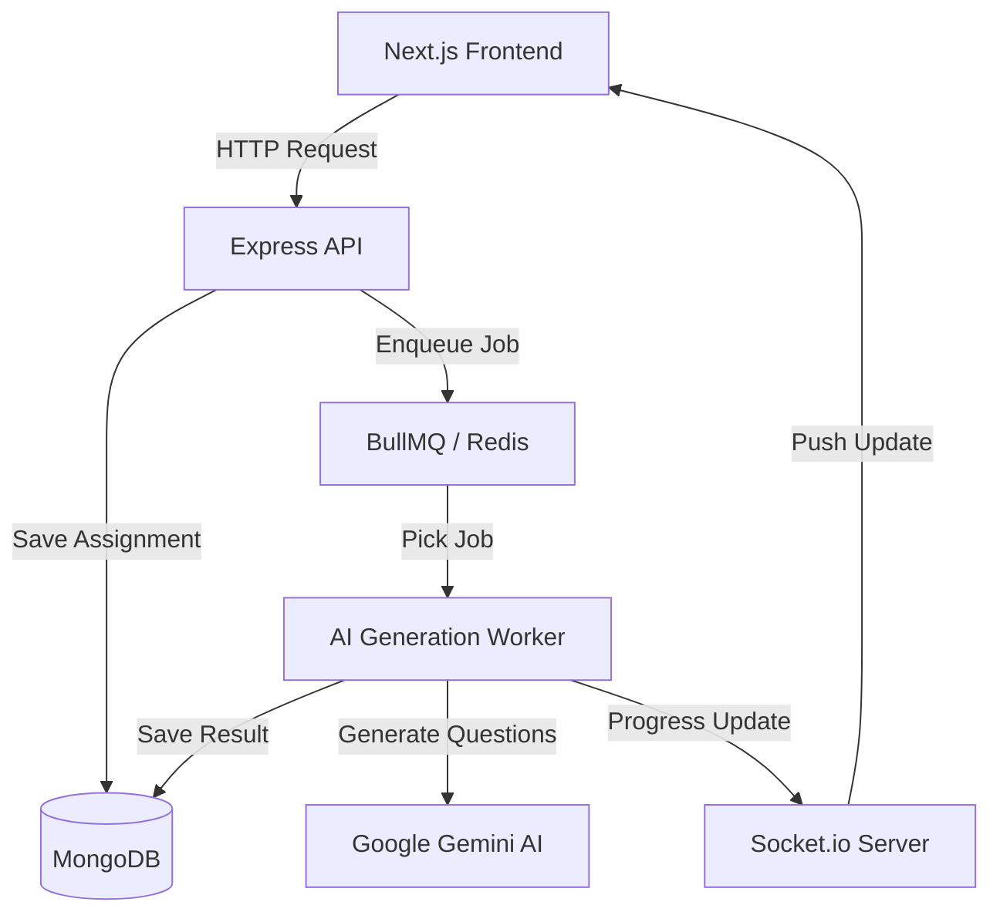

# High-Level Design (HLD)

System Architecture

VedaAI is built to handle heavy AI tasks without slowing down the user's browser. I used a distributed architecture that separates the API from the AI processing.

Architecture Diagram:

Architectural Choices

1. Background Worker (BullMQ)
AI generation can take 30-40 seconds. I used BullMQ and Redis to handle this in the background. This ensures the API server stays responsive and can handle other users while the AI is thinking.

2. Real-time Feedback (Socket.io)
Since the generation happens in the background, the user needs to know what is happening. I used WebSockets to push live progress updates (10%, 80%, etc.) from the worker directly to the dashboard.

3. Persistence (MongoDB)
I chose MongoDB because the generated question papers have a nested, flexible structure (sections, questions, answers). A document database is a natural fit for this kind of data.

4. Frontend Shell (Next.js)
The frontend uses Next.js with a custom AppShell. This handles the UI replication for both desktop and mobile while ensuring that the site loads quickly and doesn't have hydration errors.

Data Flow Steps
1. The user fills out the form and clicks "Create".
2. The server creates a record in MongoDB with a "pending" status.
3. A background job is created in Redis.
4. The worker picks up the job, sends the prompt to Gemini, and updates the status to "processing".
5. As the AI works, the worker sends status messages back to the UI via WebSockets.
6. Once the paper is ready, it is saved to the database and the user is notified to view the output.
