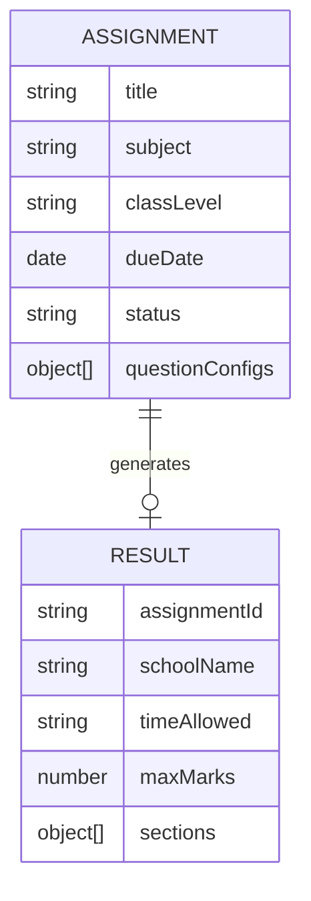
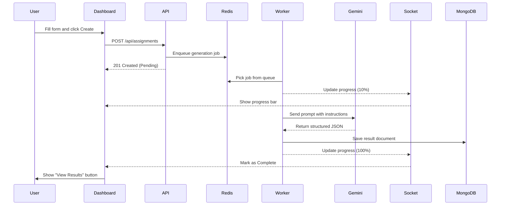

# Low-Level Design (LLD)

Project Structure

I organized the codebase into clear modules for the frontend and backend. 

Database Models (ERD)

VedaAI uses two main collections in MongoDB.

Sequence Diagram

The following diagram shows the end-to-end signal flow when a new assignment is created.

Component Logic

1. Dashboard (Dashboard/page.tsx)
The dashboard uses a mounting guard (`mounted` state) to ensure that the initial HTML from the server matches the first render in the browser. This prevents hydration errors caused by browser extensions.

2. Assignment Form (AssignmentForm.tsx)
The form uses Zustand to keep track of the assignment state globally. It calculates the total marks and question count automatically as the user adjusts the stepper values. 

3. Result Display (ResultDisplay.tsx)
This component connects to the WebSocket server once the assignment ID is known. It listens for `generation:progress` events to update the UI feedback. It also includes the print-specific CSS required for the "Download PDF" functionality.

4. AI Service (aiService.ts)
This is where the prompt engineering happens. I built a prompt that forces Gemini to return a clean JSON object. The service also includes a parser that removes any AI-generated markdown tags before the data is saved to the database.
